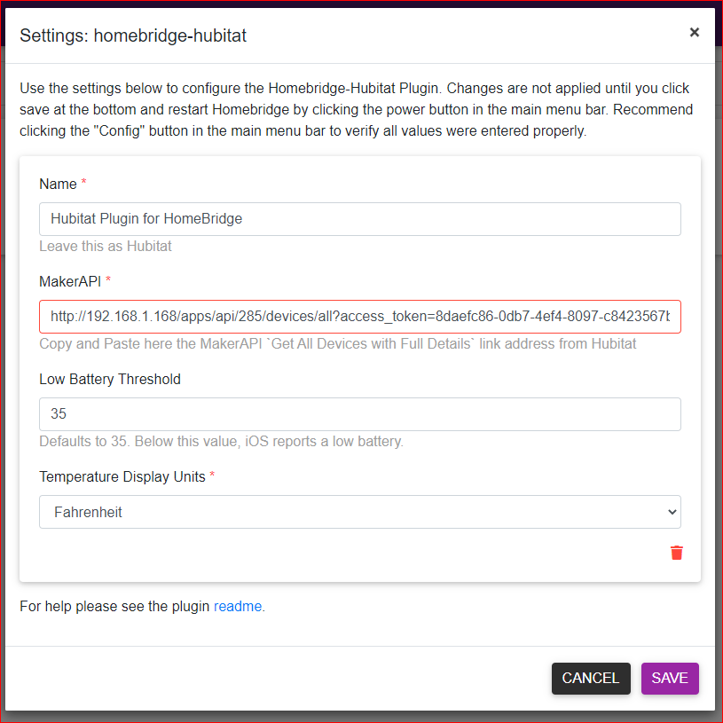

# Homebridge-Hubitat


This plugin is in "beta testing" status. Please post any issues in github in the "issues" category. 

Many of the log messages will be removed in the coming weeks - they are there for my debugging purposes as I develop the code.

There are 3 basic task you will have to perform to get the plugin working:
1. Install Homebridge
2. Install the Plugin
3. Configure "MakerAPI" on Hubitat

The instructions, below, will give you basic information on all these tasks.

These instructions are a bit "rough" for now, but will be clarified.


## 1. Installation of HomeBridge and Plugin

The Homebridge wiki has added updated instructions to install HomeBridge in Windows, Linux, and other platforms. You might want to check out those instructions for other installation options. See https://github.com/homebridge/homebridge

After homebridge is installed, install the hubitat plugin with the command:
`````
npm -g install homebridge-hubitat
`````

## 1.1. Support of Config-Ui-X
Config-UI-X is supported!


### 1.2. Updating The Hubitat Plugin
From time-to-time, you may want to update the Homebridge-Hubitat plugin to the latest version. This is done through the npm update command. To update the plugin, simply enter the following at a command prompt:
`````
npm -g update
`````
Note that this will update all of your npm modules (including those unrelated to Homebridge and this plugin). If you want to update only the homebridge-hubitat plugin, then enter:
`````
npm -g update homebridge-hubitat
`````

To check which version you currently have installed, run the command:
`````
npm -g list --depth=0
`````

## 2. Setting Up MakerAPI

Before the plugin will work, you must add "MakerAPI" to hubitat.

* Under the Hubitat Web Interface, Click on Apps in the left side menu.
* Click on the button +Add Built-In App
* Select Maker API from the list of apps
* Enable Allow Access via Local IP Address
* Tap Done and you are finished with the App configuration.
* Go into the newly added Maker API app
* Select the devices you would like to have available via HomeKit
* Scroll down below the list of selected devices and you'll find a "Get All Devices with Full Details" URL. Right-click and copy this. This is the "MakerAPI" URL that you'll need in the next step!

Select "Done" to save the MakerAPI configuration.

## 3. Setting Up Your Config.json file

As Homebridge plugins go, the configuration for this one is fairly simple. 

### A. Config-UI-X
If you have config-ui-x installed, it is strongly recommend that you use it for setting up your config.json

The interface is fairly simple:




### B. Manually setting up Config.json

If you insist on manually setting up config.json, then . . .

In the "platforms": area of your config.json, add a platform as set out below.
"lowBatteryThreshold" is the value (percentage) that iOS Home will use to determine when to give a low battery warning on screen.
"MakerAPI" is the "Get All Devices with Full Details" URL that you can get from the MakerAPI app page. Just right click on that link in the Maker API app page, choose "Copy Link Address" (in Chrome), or "Copy Link" (in Edge), and paste into your config.json between quotes. 


`````
		{
			"platform": "Hubitat",              
			"name": "Hubitat for HomeBridge", 
			"MakerAPI": "http://192.168.1.168/apps/api/36/devices/all?access_token=210ca37a-35d7-47db-b059-744f526999f0",
			"lowBatteryThreshold":35,
                        "temperatureUnits": "F"
		}
`````
There is a sample configuration file config.sample.json located here: https://github.com/jvmahon/homebridge-hubitat/tree/master/Config.Sample

You can also use the Config-UI-X interface to adjust these parameters.

## 4. Supported Device Types

| <u>Category                                  	|                      	|                     	|                  	|
|-------------------------------------------	|----------------------	|---------------------	|------------------	|
| <b>Lights and Switches                       	| Lightbulb            	| Switch              	| Outlet           	|
| | | |
| <b>Doors, Windows, Locks and Security Types: 	| Lock                 	| Garage Door Opener                 	| 	|
| | | |
| <b>SensorTypes:                              	| Carbon Monoxide Sensor 	|  	| Contact Sensor    	|
|                                           	| Humidity Sensor       	| LeakSensor          	| Light Sensor      	|
|                                           	| Motion Sensor         	| Occupancy Sensor     	| Smoke Sensor      	|
|                                           	| Temperature Sensor     |                     	|                  	|
| | | |
| <b>Heating and Cooling                       	| Fan            	|   Thermostat (coming soon)  	|                  	|
| | | |
| <b>Miscellaneous                             	|  Battery             	|    Valves                 	|                  	|

<b>Notes on specific types:


## 5. Notes on Switches and Fans

HomeKit supports multiple types of switches and fans. However, Hubitat doesn't always distinguish if a switch is for a lightbulb, fan, our just a plain outlet used for an applicance or just something that isn't a bulb. So ..

### A. Fans

The Plugin will distiguish a Fan in several ways:

* If the Fan appears in Hubitat as a "true" Fan (a device with a speed Control attribute), then it will be configured as a Fan.
* However, the plugin recognizes that a "fan" could also be controlled by a "regular" switch or dimmer. So, the plugin will also set up the device as a "Fan" if the word "Fan" appears in the Hubitat device label.

### B. Outlets

The plugin recognizes that not every switch is a lightbulb!  So, if the Hubitat device label includes the word "switch" or "outlet" or "heater or "appliance", then in HomeKit it will be set up as non-lightbulb Switch.

